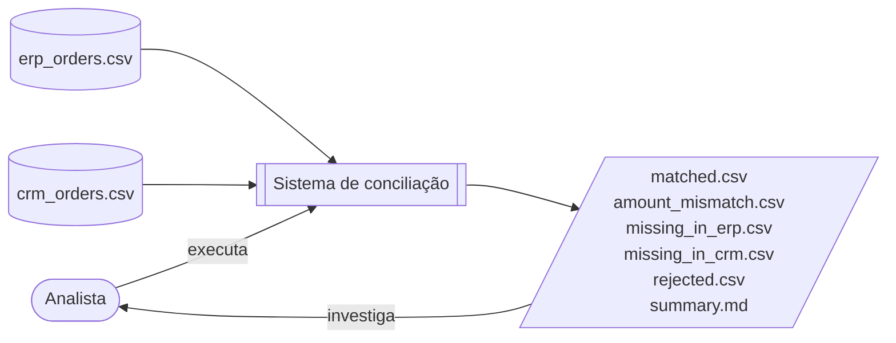

# Conciliação de pedidos ERP × CRM — design

> **Status: APROVADA (2026-10-02).** As cinco seções e as decisões da autorrevisão foram
> aprovadas, e o usuário revisou o documento inteiro. Plano de implementação:
> `docs/superpowers/plans/2026-10-02-conciliacao-erp-crm.md` (a seção "Decisões tomadas
> no plano" registra o que foi medido durante o planejamento).
>
> | Seção | Estado |
> |---|---|
> | 1. Formato de entrada e validação | ✅ aprovada (2026-09-29) |
> | 2. Estrutura do resultado e saídas | ✅ aprovada (2026-10-01) |
> | 3. Fluxo e fronteiras dos módulos | ✅ aprovada (2026-10-01) |
> | 4. Erros de arquivo e linha de comando | ✅ aprovada (2026-10-01) |
> | 5. Estratégia de testes | ✅ aprovada (2026-10-01) |
> | 10. Decisões da autorrevisão | ✅ aprovada e incorporada (2026-10-02) |
> | Revisão do documento inteiro | ✅ feita pelo usuário (2026-10-02) |

## 1. Objetivo e contexto

**Problema:** o ERP (financeiro) e o CRM (comercial) deveriam concordar sobre os pedidos, mas
divergem. A conferência manual é lenta e sujeita a erro.

**Solução:** um programa de linha de comando que compara os dois extratos CSV e separa os
pedidos em grupos, sem deixar nenhuma linha sumir em silêncio.

**Usuário:** um analista que executa o programa e investiga as divergências.

**Destino:** portfólio. Além de funcionar, o código precisa *mostrar* competência: testes,
casos de borda tratados de propósito, README claro e CI.



### Fora do escopo

- Conexão direta com ERP/CRM reais.
- Várias moedas.
- Casamento aproximado de identificadores.
- **Interface web: adiada para a fase 2.** Uma página simples onde o visitante envia os dois
  CSVs e vê o resultado. É uma mudança de escopo registrada, não um detalhe. Onde o
  processamento acontece (navegador ou servidor) será decidido na fase 2.
- **Estudo de caso com dados públicos: fase 1.5** (decidido em 2026-10-01). Um script à
  parte, fora do CI, roda a conciliação sobre o *Olist Brazilian E-commerce* (Kaggle):
  "ERP" = soma dos pagamentos por pedido; "CRM" = soma de preço + frete dos itens. Antes de
  construir qualquer coisa, uma verificação barata: (1) **medir** se essas somas de fato
  divergem em alguns pedidos — hoje é hipótese, não fato; (2) conferir se a licença permite
  redistribuir os arquivos ou se o script deve apenas baixá-los. Se não houver divergências
  reais, o estudo de caso é descartado.
  **Verificação feita em 2026-10-02:** as somas divergem em 576 pedidos (0,58%), há 775
  pedidos só com pagamento e 1 só com itens; a licença é CC BY-NC-SA 4.0, então o script
  baixa os dados em vez de redistribuí-los. O estudo segue: Tarefas 10 e 11 do plano.
- **Por que os dados públicos não substituem os sintéticos:** teste precisa de gabarito.
  Nos sintéticos cada defeito é plantado e a resposta certa é conhecida; num conjunto
  público ninguém sabe qual é a conciliação correta, então ele prova que o programa
  **roda**, não que **acerta**. E não existe conjunto público de conciliação ERP × CRM:
  qualquer um teria de ser adaptado por nós.

## 2. Decisões de base

| Tema | Decisão |
|---|---|
| Dados | Formato definido por nós; dados sintéticos com cada problema colocado de propósito para virar teste |
| Implementações | **Duas**: Python só com biblioteca padrão (`csv` + `decimal`) e Python com pandas |
| Equivalência | Os dois motores passam pela **mesma bateria de testes** e produzem **saída idêntica** |
| Testes | `pytest`, com `hypothesis` como segunda camada (testes baseados em propriedades) |
| Skills de terceiros | Nenhuma instalada: TDD já coberto e documentação de API via `context7` |

## 3. Arquitetura escolhida: contrato compartilhado, motores independentes

```
reconcile/
  contract.py      # tipos do resultado (ReconciliationResult), motivos de rejeição
  writer.py        # grava os 6 arquivos a partir de um ReconciliationResult
  cli.py           # argparse → escolhe o motor → writer
  inputs.py        # nome + SHA-256 de cada arquivo de entrada
  engines/
    stdlib.py      # caminhos dos CSVs → ReconciliationResult  (csv + decimal)
    pandas.py      # caminhos dos CSVs → ReconciliationResult  (pandas)
tests/
  test_engines.py  # UM conjunto de testes, parametrizado para rodar nos dois motores
tools/
  generate.py      # gerador de dados sintéticos em escala (Seção 5)
```

A árvore acima é indicativa; a divisão final dos arquivos de teste fica para o plano.

- **A fronteira:** cada motor recebe os **caminhos dos arquivos** e devolve um **resultado
  canônico**. Leitura, validação, quarentena e casamento ficam dentro de cada motor. Só a
  gravação da saída e a linha de comando são comuns.
- **Por que ali:** leitura e validação são exatamente onde o pandas se comporta diferente
  (inferência de tipos, `float`, zeros à esquerda). Se essa parte fosse comum, a versão
  pandas viraria só um `merge` e a comparação não mostraria nada.

**Alternativas descartadas:**

- *Dois programas completamente separados:* duplica a CLI e a formatação. Uma diferença
  como `100.0` contra `100.00` vira ruído que esconde as diferenças reais de lógica.
- *Validação comum, só o casamento em pandas:* esvazia a comparação, porque o pandas nunca
  enfrentaria os casos difíceis.

## 4. Regras de negócio

| Regra | Decisão |
|---|---|
| Linha com número de campos diferente do cabeçalho | `rejected.csv` (`malformed_row`) |
| ID duplicado no mesmo arquivo | **todas** as ocorrências vão para `rejected.csv` (`duplicate_id`) |
| ID vazio ou valor inválido | `rejected.csv`, com o motivo |
| ID com espaço nas bordas | `rejected.csv` (`id_whitespace`) |
| Comparação de IDs | exata, caractere por caractere, diferenciando maiúsculas e minúsculas |
| Comparação de valores | `Decimal`, igualdade exata; qualquer diferença vai para `amount_mismatch` |
| Fechamento | linhas lidas = conciliadas + rejeitadas, provado no `summary.md` |

**Princípio que une as regras: a ferramenta nunca altera o dado antes de comparar.** Ela
não tira espaços nem arredonda valores. O que não está no formato esperado vai para a
quarentena com um motivo explícito, e o analista decide.

## 5. Seção 1 — Formato de entrada e validação ✅

### Os CSVs

Os dois arquivos têm o **mesmo formato**: UTF-8, separados por vírgula, com cabeçalho
obrigatório.

| Coluna | Papel | Validada? |
|---|---|---|
| `order_id` | chave de casamento | sim |
| `amount` | valor comparado | sim |
| `customer` | contexto para o analista | não; repassada como texto |
| `order_date` | contexto para o analista | não; repassada como texto |

`customer` e `order_date` não entram na comparação, mas precisam sair **exatamente como
vieram**. Elas também funcionam como armadilha de teste: o pandas tende a converter
`order_date` para data e `customer` com cara de número para número.

### Regra do valor

- **Válido:** casamento **completo** com `-?[0-9]+(\.[0-9]{1,2})?`, ou seja, dígitos ASCII
  com ponto decimal opcional e **no máximo 2 casas**. Exemplos: `100`, `100.5`, `-20.00`
  (negativo representa estorno).
- **Inválido, vai para a quarentena:** `100.005` (não se arredonda), `1,000.00`, `R$ 10`,
  vazio, `١٠٠` (dígitos não ASCII), `100` seguido de quebra de linha.

**Por que `[0-9]` e casamento completo** (seção 10, item 1): em Python, `\d` aceita
dígitos de qualquer alfabeto, e o `Decimal` converteria `١٠٠` (árabe-índico) em 100. E
`^...$` com `re.match` aceita uma quebra de linha no fim, possível num campo entre aspas.
Por isso a implementação usa `re.fullmatch` (ou equivalente em cada motor) e a classe
`[0-9]`, nunca `\d`.

A expressão regular é aplicada **antes** do `Decimal` porque o `Decimal` aceita coisas que
não são valores monetários: `Decimal("1e3")` vale 1000, e `"NaN"` e `"Infinity"` também
passam. O `float` do pandas tem o mesmo problema.

### Motivos de rejeição e precedência

Cada linha rejeitada recebe **um único motivo**: o primeiro que falhar, nesta ordem.

| Ordem | `reason` | Condição |
|---|---|---|
| 0 | `malformed_row` | número de campos diferente do cabeçalho, inclusive linha totalmente vazia (acrescentado na Seção 4) |
| 1 | `missing_id` | `order_id` vazio ou só com espaços |
| 2 | `id_whitespace` | ID com algum caractere não-espaço e espaço no início ou no fim |

**ID só com espaços é `missing_id`** (seção 10, item 2): para o analista, um ID em branco
é um ID ausente; chamá-lo de "espaço nas bordas" confundiria. A precedência já garante
isso, porque `missing_id` é conferido antes.

**Linha totalmente vazia no meio do arquivo é `malformed_row`** (seção 10, item 3): os
leitores de CSV costumam pulá-la, mas pular faria uma linha sumir em silêncio e
desalinharia a numeração em relação à planilha. Ela tem 1 campo vazio, diferente da
contagem do cabeçalho, então a regra existente já a classifica, e ela entra em
`erp_rows_read`/`crm_rows_read`. A quebra de linha final do arquivo **não** é linha vazia.
Como configurar cada motor para não pular a linha é conferido na documentação durante o
plano.
| 3 | `duplicate_id` | o mesmo ID aparece mais de uma vez **no mesmo arquivo** |
| 4 | `invalid_amount` | valor vazio ou fora do formato |

A duplicidade é conferida em **todas as linhas com ID preenchido**, inclusive as que teriam
valor inválido. Se `PED-1` aparece com `100.00` e com `abc`, **as duas** caem como
`duplicate_id`. Conciliar uma das cópias seria fingir que sabemos qual é a verdadeira.

**Linha malformada na verificação de duplicidade** (decidido em 2026-10-01): ela participa
pelo seu **ID provável**, isto é, o campo na posição do `order_id` segundo o cabeçalho. Se a
linha não tem campos suficientes para chegar a essa posição, não tem ID provável e não
participa. A linha malformada mantém o motivo `malformed_row` (motivo único); as linhas
**válidas** com o mesmo ID vão para `duplicate_id`.

Por quê: nenhuma regra acerta sempre, então se escolhe o erro mais barato. Ignorar a linha
malformada poderia deixar um pedido duvidoso em `matched`, onde ninguém olha; usá-la pode,
no máximo, mandar um pedido bom para a quarentena, que é justamente o que o analista revisa.
Um falso "confira isto" custa minutos; um falso "está tudo certo" passa em silêncio. Também
é coerente com a regra de duplicidade acima. Alternativa descartada: excluir a linha
malformada da verificação (proposta inicial, revista).

## 6. Seção 2 — Estrutura do resultado e saídas ✅

### O resultado canônico (`contract.py`)

*Dataclasses* imutáveis (`frozen=True`), sem nenhum tipo do pandas. Assim o teste
diferencial se reduz a `resultado_stdlib == resultado_pandas`.

```python
@dataclass(frozen=True)
class Order:              # uma linha válida
    order_id: str
    amount: Decimal
    customer: str
    order_date: str
    line: int             # linha como a planilha mostra (cabeçalho = 1)

@dataclass(frozen=True)
class Rejected:
    source: Literal["erp", "crm"]
    line: int
    reason: Reason        # Enum: MALFORMED_ROW, MISSING_ID, ID_WHITESPACE, DUPLICATE_ID, INVALID_AMOUNT
    raw: dict[str, str]   # a linha exatamente como veio (por posição, se malformada)
    extra_fields: tuple[str, ...]  # campos além do cabeçalho; vazio se a linha não é malformada

@dataclass(frozen=True)
class Pair:               # o pedido existe nos dois lados
    erp: Order
    crm: Order

@dataclass(frozen=True)
class ReconciliationResult:
    matched: tuple[Pair, ...]
    amount_mismatch: tuple[Pair, ...]
    missing_in_erp: tuple[Order, ...]   # só no CRM
    missing_in_crm: tuple[Order, ...]   # só no ERP
    rejected: tuple[Rejected, ...]
    erp_rows_read: int
    crm_rows_read: int
```

- `difference` **não** é campo: é derivado (`crm.amount - erp.amount`) e calculado ao gravar.
- **Ordem determinística:** tuplas ordenadas por `order_id` (comparação padrão de `str`, por
  ponto de código Unicode); `rejected` por `(source, line)`, com `erp` antes de `crm`.
- **`erp_rows_read` / `crm_rows_read`:** número de registros de dados do arquivo, sem o
  cabeçalho, incluindo os malformados e as linhas vazias (seção 10).

### Os arquivos

| Arquivo | Colunas |
|---|---|
| `matched.csv` | `order_id, amount, erp_customer, erp_order_date, crm_customer, crm_order_date` (`amount` vem do ERP; os dois lados são iguais por definição) |
| `amount_mismatch.csv` | `order_id, erp_amount, crm_amount, difference, erp_customer, crm_customer, erp_line, crm_line` |
| `missing_in_erp.csv` | `order_id, amount, customer, order_date, crm_line` |
| `missing_in_crm.csv` | `order_id, amount, customer, order_date, erp_line` |
| `rejected.csv` | `source, line, reason, order_id, amount, customer, order_date, extra_fields` (texto bruto) |

**Decisões:**

- **Linha malformada no `rejected.csv`:** os campos disponíveis são preenchidos **por
  posição** e os que faltam ficam vazios; os campos que sobram vão para `extra_fields`, para
  que nenhum dado se perca. O `reason = malformed_row` sinaliza que as posições não são
  confiáveis. Nas demais linhas, `extra_fields` fica vazio. Alternativa descartada: guardar
  a linha original inteira, porque nenhum dos dois leitores devolve o texto cru do registro.
- **`extra_fields` gravado como lista JSON** (seção 10, item 5): `["x","y"]`, e célula
  vazia quando não há campos extras. Juntar com vírgula ou `|` seria ambíguo se um campo
  extra contivesse o separador; JSON não é ambíguo e está na biblioteca padrão. A
  serialização é fixa (`json.dumps` com `ensure_ascii=False` e separadores sem espaço, a
  conferir no plano) para que os dois motores gravem os mesmos bytes.
- **Convenção de sinal:** `difference = crm_amount − erp_amount`. Positivo quer dizer que o
  CRM registrou mais que o ERP. A convenção é escrita no cabeçalho do `summary.md`.
- **Valores nas saídas com 2 casas** (`100.5` vira `100.50`): só muda a apresentação. Em
  `rejected.csv` o texto sai bruto.
- **Saída determinística:** a mesma entrada gera os mesmos bytes, em qualquer execução e em
  qualquer motor. Por isso o `summary.md` **não** tem data, hora nem nome do motor (a CLI
  mostra o motor no terminal). Isso viabiliza testes com arquivos de referência e a prova
  de que os dois motores geram arquivos idênticos byte a byte.
- **Procedência pelos dados, não pela hora:** o `summary.md` traz o nome de cada arquivo de
  entrada (sem o caminho, que varia entre máquinas) e o seu **SHA-256**. O hash identifica
  quais extratos foram conciliados e depende só da entrada, então não quebra o
  determinismo. Alternativas descartadas: gravar data e motor e mascarar nos testes
  (frágil, e quebra a comparação byte a byte); hora como parâmetro (não identifica os
  dados). Um `run.json` com hora, motor e versão fica para quando houver necessidade
  declarada de auditoria.

### O `summary.md`

- Contagem de cada grupo e soma das diferenças de valor.
- Prova de fechamento, por lado:
  - `ERP: linhas lidas = rejeitadas + matched + amount_mismatch + missing_in_crm`
  - `CRM: linhas lidas = rejeitadas + matched + amount_mismatch + missing_in_erp`
- Contagem de rejeições por motivo.
- Bloco **Entradas**: nome do arquivo e SHA-256 de cada CSV.

## 7. Seção 3 — Fluxo e fronteiras dos módulos ✅

### Fluxo de uma execução

```
cli.py
  1. argumentos: --erp, --crm, --out, --engine {stdlib,pandas} (padrão: stdlib)
  2. engine = get_engine(nome)              # engines/__init__.py, import tardio
  3. result = engine(erp_path, crm_path)    # -> ReconciliationResult
  4. inputs = fingerprint(erp_path), fingerprint(crm_path)   # inputs.py: nome + SHA-256
  5. write_outputs(result, inputs, out_dir) # writer.py: os 6 arquivos
  6. terminal: motor usado, contagens, pasta de saída
```

Dentro de cada motor, as mesmas etapas, implementadas de forma independente:
`ler → classificar rejeições (na ordem da Seção 1) → casar por order_id → montar o resultado ordenado`.

### Módulos

| Módulo | Responsabilidade | Depende de |
|---|---|---|
| `contract.py` | tipos do resultado, `Reason`, colunas obrigatórias, **expressão regular do valor** | nada |
| `engines/stdlib.py` | `reconcile(erp: Path, crm: Path) -> ReconciliationResult` com `csv` + `decimal` | `contract` |
| `engines/pandas.py` | a mesma assinatura, com pandas | `contract`, pandas |
| `engines/__init__.py` | `get_engine(nome)`; importa o motor pandas só quando pedido | motores |
| `inputs.py` | `fingerprint(path) -> InputFile(name, sha256)` | nada |
| `writer.py` | `write_outputs(result, inputs, out_dir)`; formata 2 casas, calcula `difference` | `contract` |
| `cli.py` | orquestra os passos acima | todos |

### Decisões

- **A expressão regular do valor fica no contrato, compartilhada.** Ela é especificação, não
  implementação; cada motor a aplica do seu jeito. Risco aceito: um erro na expressão
  afetaria os dois motores e o teste diferencial não o pegaria; quem pega são os casos
  escritos à mão (`100.005`, `NaN`, `1e3`).
- **pandas como dependência opcional.** `pip install .` instala só o motor stdlib;
  `pip install .[pandas]` adiciona o outro. O import do pandas acontece apenas quando
  `--engine pandas` é escolhido, para que a afirmação "a versão stdlib não tem
  dependências" seja verdadeira.
- **Procedência calculada fora dos motores** (`inputs.py`): o hash não é lógica de
  conciliação, e calculá-lo em cada motor seria duplicação sem valor comparativo.

### Detalhes que os motores precisam respeitar

- **Motor pandas lê tudo como texto:** `dtype=str, na_filter=False` (conferido na
  documentação do `read_csv`). Assim, vazio continua `""`, zeros à esquerda se mantêm e
  `NaN` é só texto. A conversão para `Decimal` acontece apenas nas linhas válidas, e nunca
  passa por `float`.
- **Número da linha = posição do registro + 1 (cabeçalho é a linha 1)**, não a linha física
  do arquivo. Um campo entre aspas com quebra de linha ocupa duas linhas físicas, mas a
  planilha mostra um registro só. Os dois motores contam do mesmo jeito.
- **Saída byte a byte idêntica em qualquer sistema:** UTF-8 e terminador de linha fixo em
  todos os arquivos. Sem isso, Windows e Linux (CI) gerariam bytes diferentes.

## 8. Seção 4 — Erros de arquivo e linha de comando ✅

### Princípio: problema de linha vira dado; problema de arquivo interrompe

Uma linha ruim não pode impedir a conciliação das outras: ela vai para `rejected.csv`. Um
arquivo que não dá para interpretar interrompe a execução **antes de gravar qualquer
saída**, com uma mensagem de uma linha em stderr.

### Erros que interrompem (código de saída 2)

| Situação | Mensagem indica |
|---|---|
| Arquivo inexistente ou sem permissão de leitura | o caminho |
| Arquivo vazio, sem cabeçalho | o caminho |
| Conteúdo que não é UTF-8 | o caminho e a posição do primeiro byte inválido |
| Cabeçalho sem uma ou mais colunas obrigatórias | quais colunas faltam |
| Nome de coluna repetido no cabeçalho | qual coluna |
| `--engine pandas` sem o pandas instalado | o comando `pip install .[pandas]` |

- Um arquivo **só com cabeçalho** é válido: o resultado tem zero linhas e fecha as contas.
- **Colunas extras** são aceitas e ignoradas (exportações reais costumam trazer colunas a mais).
- **Nomes de coluna comparados exatamente** (seção 10, item 4): `Order_ID` ou ` amount`
  não são colunas obrigatórias, então o arquivo é interrompido com "faltam colunas", e a
  mensagem mostra os nomes encontrados para o analista ver a diferença. É coerente com a
  comparação exata de IDs e com o princípio de não alterar o dado. A única exceção é o BOM
  (abaixo), que não faz parte do nome.
- **BOM do UTF-8 é aceito.** O Excel grava "CSV UTF-8" com BOM; sem esse tratamento a
  primeira coluna viraria `\ufefforder_id` e a mensagem seria "falta a coluna order_id",
  confusa para o analista. O BOM é marcação de codificação, não dado, então aceitá-lo não
  contradiz o princípio de não alterar o dado.
- **Coluna repetida interrompe** porque os motores divergiriam em silêncio: o leitor da
  biblioteca padrão fica com a última ocorrência e o pandas renomeia a segunda.
- Erros **esperados** (os da tabela) saem sem *traceback*; erros inesperados mantêm o
  *traceback*, para não esconder defeito.

### Mudança na Seção 1: novo motivo `malformed_row` (aprovada; já refletida na Seção 1)

Uma linha com número de campos diferente do cabeçalho vai para `rejected.csv` com
`reason = malformed_row`, **primeiro** na ordem de precedência (antes de `missing_id`), porque
sem a contagem certa de campos não dá para saber qual valor é de qual coluna. O
comportamento padrão do pandas com essas linhas será conferido na documentação durante o
plano; o motor precisa ser configurado para não abortar nem descartar a linha em silêncio.

### Códigos de saída (convenção do `diff`)

| Código | Significado |
|---|---|
| 0 | executou; tudo conciliado, sem divergências nem rejeições |
| 1 | executou; há divergências e/ou rejeições |
| 2 | não executou: erro de uso ou de arquivo |

Permite que um agendamento ou script reaja a divergências sem ler os arquivos.

### Linha de comando e gravação

- `--erp` e `--crm` obrigatórios; `--out` com padrão `output/`; `--engine` com padrão `stdlib`.
- A pasta de saída é criada se não existir; os 6 arquivos são **sobrescritos** (a execução
  é reprodutível pelos hashes das entradas).
- **Sem mistura de execuções:** os 6 arquivos são gravados primeiro numa pasta temporária e
  só então movidos para o destino, para que uma falha de disco no meio não deixe um
  `summary.md` antigo ao lado de um `matched.csv` novo.

## 9. Seção 5 — Estratégia de testes ✅

Os testes são escritos **antes** do código de cada motor (TDD). Todas as camadas rodam nos
**dois motores**, por um único *fixture* `engine` parametrizado com `stdlib` e `pandas`.

### Camada 1 — Casos de exemplo (o gabarito)

Um teste por regra, cada um com um CSV pequeno escrito **dentro do próprio teste** (gravado
em `tmp_path`), para que o caso e a resposta esperada fiquem lado a lado. Cobertura mínima:

- cada `reason`, inclusive as precedências (duplicado com valor inválido → `duplicate_id`;
  linha malformada torna duplicadas as linhas válidas com o mesmo ID provável; linha
  malformada curta demais para ter ID provável não afeta ninguém);
- valor: `100`, `100.5`, `-20.00` válidos; `100.005`, `1,000.00`, `R$ 10`, `NaN`,
  `Infinity`, `1e3`, `١٠٠`, `"100\n"` (entre aspas), vazio inválidos;
- ID só com espaços → `missing_id`; ID ` PED-1` → `id_whitespace`;
- linha totalmente vazia no meio do arquivo → `malformed_row`, contada nas linhas lidas;
  quebra de linha final do arquivo não gera rejeição;
- linha malformada com campos a mais → `extra_fields` como lista JSON, inclusive um campo
  extra que contém vírgula;
- texto preservado: ID `007`, `customer` `00123`, `order_date` em qualquer formato;
- campo entre aspas com quebra de linha (número da linha = registro, não linha física);
- arquivo com BOM, colunas extras, só cabeçalho; cabeçalho com `Order_ID` interrompe;
- igualdade exata: `100.00` × `100.01` vai para `amount_mismatch` com `difference = 0.01`.

### Camada 2 — Arquivos de referência (ponta a ponta)

Um cenário completo em `tests/fixtures/scenario/` (dois CSVs + os 6 arquivos esperados). O
teste roda a **CLI** com cada motor e compara os arquivos **byte a byte** com os esperados.
Cobre escrita, formatação, `summary.md`, hashes e o determinismo aprovado na Seção 2.
Os arquivos esperados são regenerados **manualmente** e revisados no `git diff`; não há
opção automática de "atualizar referências", que convida a aprovar sem ler.

### Camada 3 — Propriedades (`hypothesis`)

Estratégias geram pares de CSV com IDs de alfabeto pequeno (para forçar colisões), espaços
nas bordas, IDs vazios e valores misturando válidos e inválidos. Propriedades exigidas:

1. **Diferencial:** resultado do stdlib `==` resultado do pandas.
2. **Partição:** cada linha de dados de cada arquivo aparece **exatamente uma vez** no
   resultado (mais forte que a contagem do fechamento: pega linha perdida *e* duplicada).
3. **Fechamento:** as duas equações do `summary.md` valem.
4. **Coerência:** todo par em `matched` tem valores iguais; todo par em `amount_mismatch`,
   diferentes.

O limite de tempo por exemplo da `hypothesis` precisa ser ajustado para o motor pandas;
o nome exato da configuração será conferido na documentação durante o plano.

### Camada 4 — Linha de comando

Códigos de saída 0/1/2, mensagens dos erros de arquivo da Seção 4 e a mensagem de pandas
ausente (simulando a falha do import).

### Gerador em escala e benchmark

- `tools/generate.py`: N pedidos, taxas de defeito configuráveis, semente fixa. Um teste de
  fumaça garante que a saída dele concilia e fecha as contas.
- O **benchmark** stdlib × pandas é um script à parte, **fora da suíte de testes**: tempo
  medido em CI compartilhado é ruidoso demais para virar asserção. Os números vão para o
  README com a descrição da máquina.

### Ambiente e CI

- Python **≥ 3.11**.
- No ambiente de desenvolvimento o pandas é **sempre** instalado (`.[pandas,dev]`): os testes
  do motor pandas nunca são pulados em silêncio. O pandas é opcional só para quem usa.
- GitHub Actions com matriz **Ubuntu + Windows**, provando que a saída é idêntica byte a
  byte nos dois sistemas (terminador de linha fixo, Seção 3).
- `ruff` (lint e formatação) e `mypy` no CI. Cobertura é medida e exibida, mas **sem**
  percentual mínimo obrigatório.

## 10. Decisões da autorrevisão ✅ (aprovadas em 2026-10-02)

A releitura do documento completo encontrou lacunas que fariam duas pessoas implementarem
de formas diferentes. Cada uma foi resolvida pelo princípio já aprovado ("nunca alterar o
dado; o que foge do formato vai para a quarentena; nenhuma linha some em silêncio"),
aprovada pelo usuário e **incorporada à seção onde vale**. Esta lista fica como índice e
registro do porquê das mudanças.

| # | Decisão | Onde está |
|---|---|---|
| 1 | Regex do valor com `[0-9]` e casamento completo (`\d` e `$` deixavam passar `١٠٠` e `"100\n"`) | §5, Regra do valor |
| 2 | ID só com espaços é `missing_id`, não `id_whitespace` | §5, Motivos de rejeição |
| 3 | Linha totalmente vazia no meio do arquivo é `malformed_row` | §5, Motivos de rejeição |
| 4 | Nomes de coluna comparados exatamente (`Order_ID` interrompe) | §8, Erros que interrompem |
| 5 | `extra_fields` gravado como lista JSON | §6, Decisões |
| 6 | `amount` do `matched.csv` vem do ERP | §6, tabela dos arquivos |

Cada decisão ganhou também um caso de teste na Camada 1 (§9).
